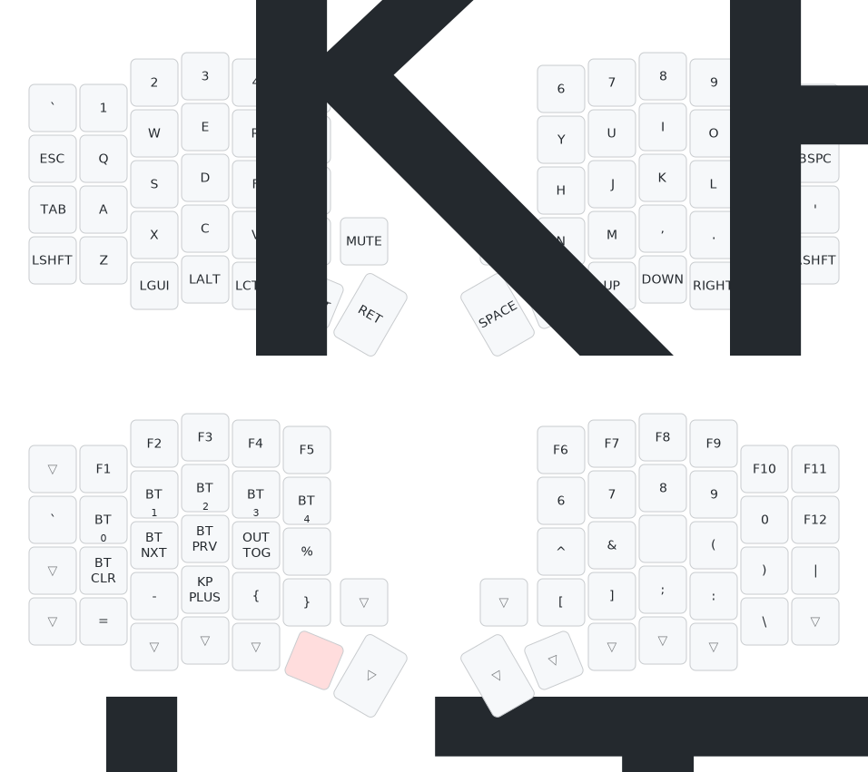

# zmk-config
Firmware for my custom mechanical keyboards. Built with [ZMK Firmware](https://zmk.dev), graphics by [keymap-drawer](https://github.com/caksoylar/keymap-drawer).

### [Sofle](https://github.com/josefadamcik/SofleKeyboard) v1.0 + [nice!nano](https://nicekeyboards.com/nice-nano) v2.0

