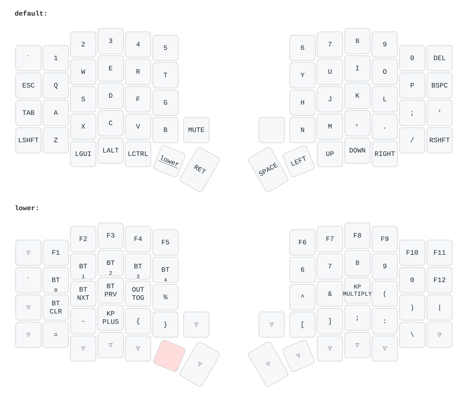

# zmk-config
Firmware for my custom mechanical keyboards. Built with [ZMK Firmware](https://zmk.dev), graphics by [keymap-drawer](https://github.com/caksoylar/keymap-drawer).

## [Sofle](https://github.com/josefadamcik/SofleKeyboard) v1.0 + [nice!nano](https://nicekeyboards.com/nice-nano) v2.0

## [Elora](https://splitkb.com/products/elora) rev1

splitkb only ships QMK/Vial for this board. This repo is also a Zephyr module that adds a ZMK port:

- `boards/splitkb/splitkb_elora_rev1`: board definition for each half (RP2040 on the board, pins from QMK's `splitkb/elora/rev1`)
- `drivers/kscan`: polls the 74HC165 shift-register chain that carries the switches and encoders
- `config/splitkb_elora_rev1.keymap`: the Sofle keymap, ported to this board

Wired split uses ZMK's full-duplex UART transport, which ZMK calls experimental. The left half is the central, so connect USB to the left half.

Flashing: double-tap the reset button on the side of the PCB, or hold the Boot button near the USB port while you plug in. Then copy the `.uf2` to the `RPI-RP2` drive. `&bootloader` is on the lower layer.

Not yet supported: OLED, Myriad modules. RGB underglow is wired up but off; add `CONFIG_ZMK_RGB_UNDERGLOW=y` to `config/splitkb_elora_rev1.conf` to turn it on.
